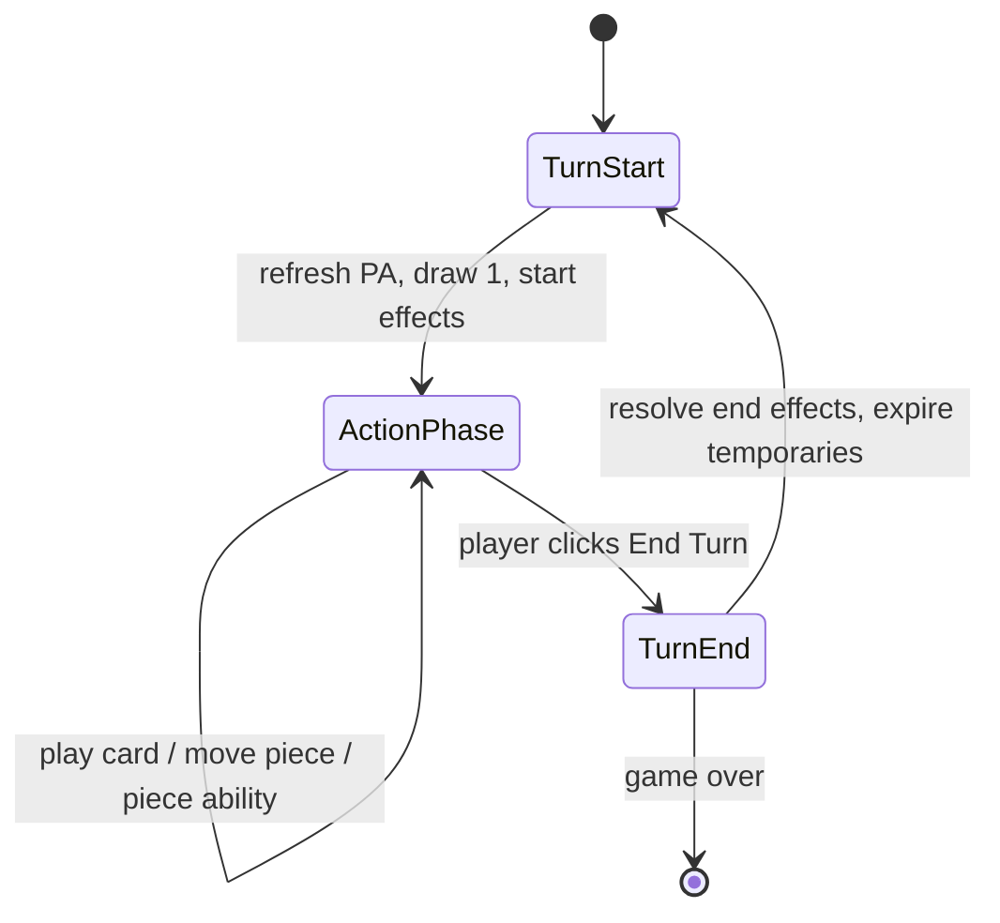
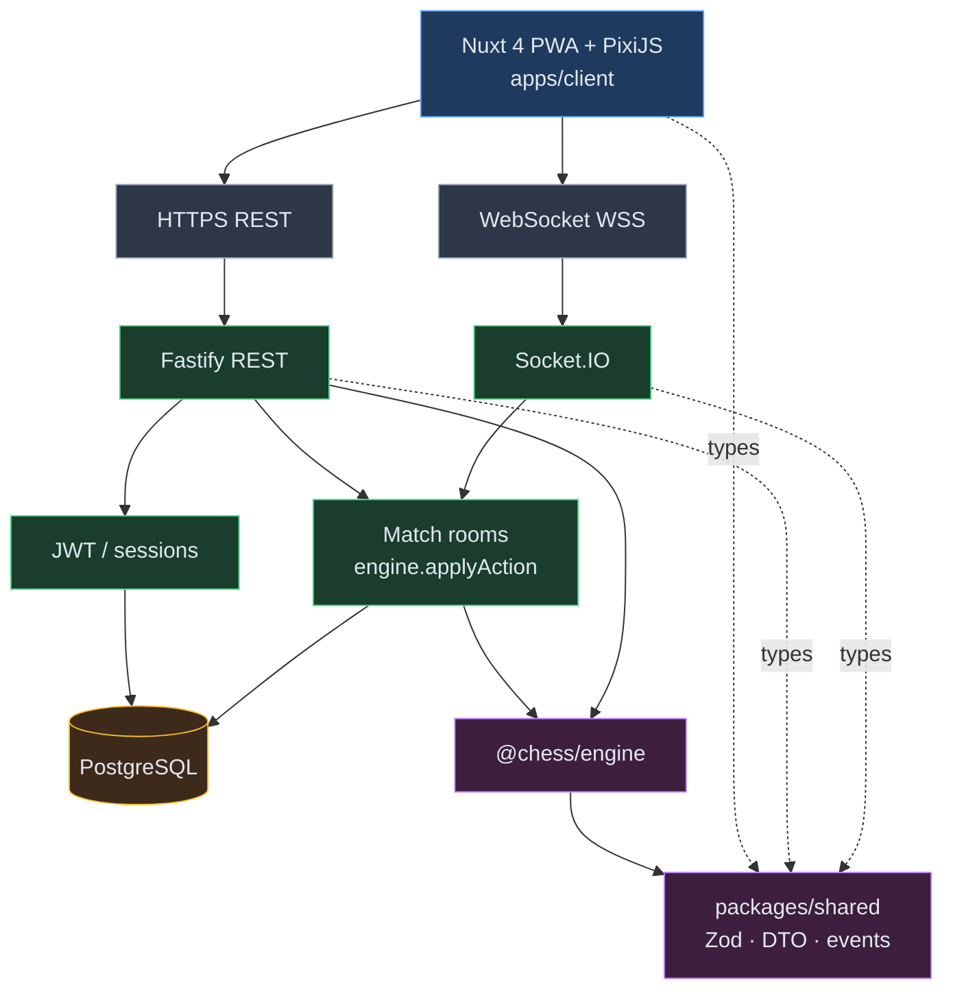
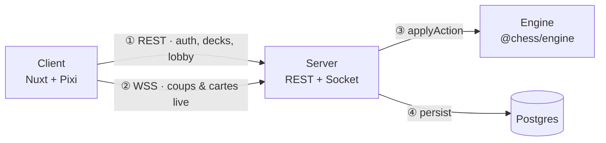
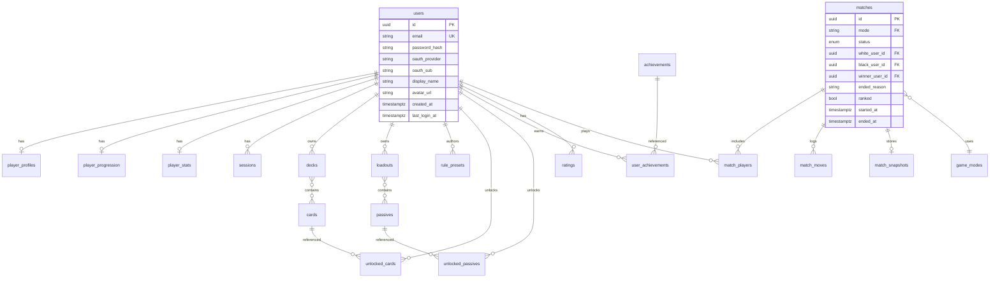
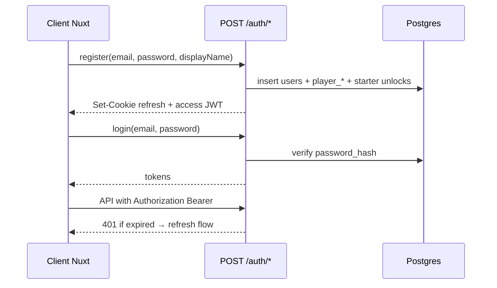
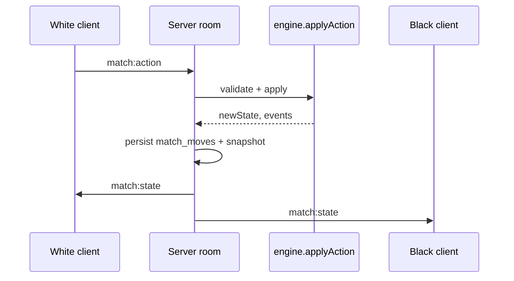
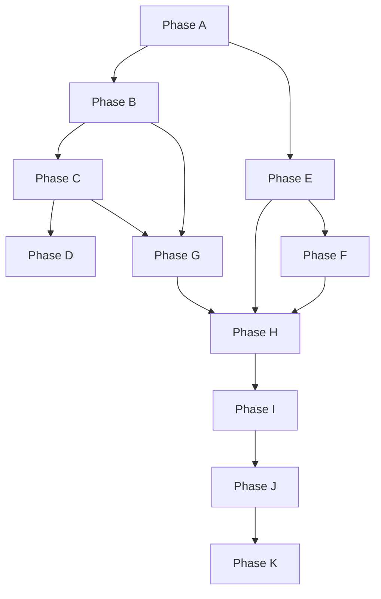

# Regna (Chess Evolved) — plan produit & technique

Document de référence pour le développement de l’application complète (auth, BDD, stats, online, PWA PC/mobile).

**Références :** GDD v1 (`docs/PDF document.pdf`), synthèse `docs/1.md`, bootstrap `docs/regna-setup.md`.

**État repo au 2026-05-21 :** monorepo + dépendances déclarées + sprites sous `src/sprites/` ; pas de code métier engine/server ; client = page Nuxt par défaut.

**Export PDF :** [`PRODUCT-PLAN.pdf`](./PRODUCT-PLAN.pdf) — régénération : `./scripts/generate-product-plan-pdf.sh` (nécessite `pandoc` + `typst`).

---

## Table des matières

1. [Vision produit](#1-vision-produit)
2. [Architecture système](#2-architecture-système)
3. [Structure cible du monorepo](#3-structure-cible-du-monorepo)
4. [Variables d’environnement](#4-variables-denvironnement)
5. [Schéma base de données](#5-schéma-base-de-données)
6. [Authentification & sécurité](#6-authentification--sécurité)
7. [API REST](#7-api-rest)
8. [Socket.IO — contrats temps réel](#8-socketio--contrats-temps-réel)
9. [Moteur `@chess/engine`](#9-moteur-chessengine)
10. [Client Nuxt — routes & écrans](#10-client-nuxt--routes--écrans)
11. [Roadmap par phases](#11-roadmap-par-phases)
12. [Jalons (milestones)](#12-jalons-milestones)
13. [Ordre d’exécution](#13-ordre-dexécution)

---

## 1. Vision produit

### 1.1 Piliers GDD

| Pilier               | Description                                         | Impact technique                               |
| -------------------- | --------------------------------------------------- | ---------------------------------------------- |
| **Buildcraft**       | Pouvoirs / passifs / règles avant partie            | Tables `decks`, `loadouts`, `rule_presets`     |
| **Cartes + PA**      | Cœur du gameplay (deck 10–15, pioche/tour, coûts)   | Moteur d’effets + UI main + validation serveur |
| **Échecs évolutifs** | Socle reconnaissable, règles altérables             | `@chess/engine` extensible                     |
| **Parties live**     | Tour par tour temps réel                            | Socket.IO, serveur autoritaire                 |
| **Online & social**  | Matchmaking, ELO, privé, sandbox, presets           | Queue, `ratings`, rooms                        |
| **Progression**      | XP, déblocages, succès (pas de lootbox court terme) | `player_progression`, `unlocked_*`             |
| **PC + mobile**      | Web responsive + PWA                                | Nuxt mobile-first, Pixi tactile                |

### 1.2 Hors scope v1 (prévoir le schéma)

- Modes aléatoires / déblocage mid-game (GDD §9.2)
- OAuth (option v1.1 — colonnes prêtes sur `users`)
- Redis pour matchmaking à grande échelle
- Replays vidéo lourds (snapshots + journal suffisent en v1)

### 1.3 Déroulement d’un tour (GDD §14)



---

## 2. Architecture système

**Légende :** trait plein = runtime (réseau / BDD) · trait pointillé = types partagés à la compilation (`packages/shared`).



Vue simplifiée (même système, lecture gauche → droite) :



**Principe non négociable :** en partie classée, le **serveur** applique toutes les actions via `@chess/engine`. Le client n’applique une action localement qu’en **sandbox solo**.

---

## 3. Structure cible du monorepo

```text
Regna/
├── src/
│   ├── sprites/              # assets (voir sprites.mdc)
│   ├── README.md
│   └── PRODUCT-PLAN.md       # ce document
├── packages/
│   ├── engine/               # @chess/engine — règles pures
│   └── shared/               # types Zod, events Socket, DTO REST
├── apps/
│   ├── client/               # Nuxt 4 + Pixi + PWA
│   └── server/               # Fastify + Socket.IO + Prisma
│       ├── src/
│       │   ├── index.ts
│       │   ├── db/
│       │   ├── routes/
│       │   ├── socket/
│       │   └── services/
│       ├── prisma/
│       └── generated/prisma/
└── docs/                     # GDD PDF, setup, TECHNICAL-LOG
```

---

## 4. Variables d’environnement

| Variable             | Usage                     | Exemple                                       |
| -------------------- | ------------------------- | --------------------------------------------- |
| `DATABASE_URL`       | Prisma runtime (pooler) | Supabase transaction URL `:6543`            |
| `DIRECT_DATABASE_URL`| Prisma CLI              | Session pooler **:5432** (or direct `db.<ref>`) |
| `SUPABASE_URL`       | Supabase API              | `https://<ref>.supabase.co`                 |
| `SUPABASE_*_KEY`     | Auth / admin SDK          | anon (client), service_role (server only)   |
| `JWT_SECRET`         | Signature access token    | secret long aléatoire                         |
| `JWT_REFRESH_SECRET` | Refresh token (option)    | secret distinct                               |
| `CORS_ORIGIN`        | Origine client autorisée  | `http://localhost:3000`                       |
| `NODE_ENV`           | dev / production          | `development`                                 |
| `PORT`               | Port API + Socket         | `3001`                                        |
| `SOCKET_PATH`        | Chemin Socket.IO (option) | `/socket.io`                                  |
| `ACCESS_TOKEN_TTL`   | Durée access JWT          | `15m`                                         |
| `REFRESH_TOKEN_TTL`  | Durée refresh             | `7d`                                          |

Fichier `.env.example` à la racine → copier vers `apps/server/.env` — **jamais** committer `.env`.

**Mise à jour BDD (Prisma + Supabase)** — procédure détaillée : [`docs/regna-setup.md`](../docs/regna-setup.md) § *Supabase + Prisma*.

Résumé :

```bash
# Clone / nouvel environnement (migrations déjà dans le repo)
cd apps/server && pnpm db:migrate:deploy && pnpm db:generate

# Nouveau changement schema.prisma
cd apps/server && pnpm db:migrate -- --name votre_changement && pnpm db:generate

# Production
cd apps/server && pnpm db:migrate:deploy
```

---

## 5. Schéma base de données

**ORM :** Prisma + Supabase Postgres. **Conventions :** `uuid` PK, `timestamptz`, snake_case colonnes (`@@map`).

### 5.1 Diagramme entité-relation



### 5.2 Tables — identité & auth

#### `users`

| Colonne          | Type                  | Notes                   |
| ---------------- | --------------------- | ----------------------- |
| `id`             | `uuid` PK             | `gen_random_uuid()`     |
| `email`          | `varchar(255)` UNIQUE | nullable si OAuth-only  |
| `password_hash`  | `varchar`             | nullable si OAuth       |
| `oauth_provider` | `varchar(32)`         | ex. `google`, `discord` |
| `oauth_sub`      | `varchar(255)`        | UNIQUE avec provider    |
| `display_name`   | `varchar(64)`         |                         |
| `avatar_url`     | `text`                |                         |
| `created_at`     | `timestamptz`         | default now             |
| `last_login_at`  | `timestamptz`         |                         |
| `deleted_at`     | `timestamptz`         | soft delete RGPD        |

#### `sessions`

| Colonne      | Type              | Notes                 |
| ------------ | ----------------- | --------------------- |
| `id`         | `uuid` PK         |                       |
| `user_id`    | `uuid` FK → users |                       |
| `token_hash` | `varchar`         | hash du refresh token |
| `expires_at` | `timestamptz`     |                       |
| `user_agent` | `text`            |                       |
| `revoked_at` | `timestamptz`     |                       |

#### `email_verification_tokens` (option v1)

| Colonne      | Type        |
| ------------ | ----------- |
| `id`         | uuid PK     |
| `user_id`    | uuid FK     |
| `token_hash` | varchar     |
| `expires_at` | timestamptz |

### 5.3 Tables — profil & progression

#### `player_profiles`

| Colonne          | Type                     |
| ---------------- | ------------------------ |
| `user_id`        | uuid PK FK               |
| `bio`            | text                     |
| `country_code`   | char(2)                  |
| `locale`         | varchar(10) default `fr` |
| `ui_preferences` | jsonb                    |

#### `player_progression`

| Colonne     | Type              |
| ----------- | ----------------- |
| `user_id`   | uuid PK FK        |
| `xp`        | integer default 0 |
| `level`     | integer default 1 |
| `rank_tier` | varchar(32)       |

#### `player_stats` (agrégats — mis à jour post-partie)

| Colonne               | Type        |
| --------------------- | ----------- |
| `user_id`             | uuid PK FK  |
| `games_played`        | integer     |
| `wins`                | integer     |
| `losses`              | integer     |
| `draws`               | integer     |
| `cards_played`        | integer     |
| `total_play_time_sec` | integer     |
| `updated_at`          | timestamptz |

#### `ratings` (ELO par mode)

| Colonne       | Type                 |
| ------------- | -------------------- |
| `user_id`     | uuid FK              |
| `mode`        | varchar(32)          |
| `rating`      | integer default 1200 |
| `games`       | integer              |
| `peak_rating` | integer              |
| PK            | (`user_id`, `mode`)  |

### 5.4 Tables — catalogue jeu

#### `cards`

| Colonne         | Type           | Notes                                                |
| --------------- | -------------- | ---------------------------------------------------- |
| `id`            | varchar(64) PK | ex. `fracture_ligne`                                 |
| `name`          | varchar(128)   |                                                      |
| `description`   | text           |                                                      |
| `pa_cost`       | smallint       |                                                      |
| `timing`        | enum           | `before_move`, `after_move`, `anytime`, `turn_start` |
| `effect_key`    | varchar(64)    | handler dans engine                                  |
| `effect_params` | jsonb          | paramètres data-driven                               |
| `rarity`        | varchar(16)    |                                                      |
| `is_starter`    | boolean        | débloqué à la création compte                        |

#### `passives`

| Colonne         | Type           |
| --------------- | -------------- |
| `id`            | varchar(64) PK |
| `name`          | varchar(128)   |
| `description`   | text           |
| `effect_key`    | varchar(64)    |
| `effect_params` | jsonb          |

#### `game_modes`

| Colonne  | Type           |
| -------- | -------------- | ------------------------------- |
| `id`     | varchar(32) PK | `standard`, `sandbox`, `ranked` |
| `name`   | varchar(64)    |
| `config` | jsonb          | règles du mode                  |

#### `achievements`

| Colonne        | Type           |
| -------------- | -------------- |
| `id`           | varchar(64) PK |
| `name`         | varchar(128)   |
| `criteria_key` | varchar(64)    |
| `xp_reward`    | integer        |

#### `unlocked_cards` / `unlocked_passives` / `user_achievements`

| Colonne                                     | Type              |
| ------------------------------------------- | ----------------- |
| `user_id`                                   | uuid FK           |
| `card_id` / `passive_id` / `achievement_id` | FK                |
| `unlocked_at`                               | timestamptz       |
| PK composite                                | (user_id, \*\_id) |

### 5.5 Tables — buildcraft

#### `decks`

| Colonne      | Type        | Notes                       |
| ------------ | ----------- | --------------------------- |
| `id`         | uuid PK     |                             |
| `user_id`    | uuid FK     |                             |
| `name`       | varchar(64) |                             |
| `card_ids`   | jsonb       | array 10–15 ids, validé Zod |
| `is_default` | boolean     |                             |
| `created_at` | timestamptz |                             |
| `updated_at` | timestamptz |                             |

#### `loadouts`

| Colonne        | Type        |
| -------------- | ----------- | -------------------------------------- |
| `id`           | uuid PK     |
| `user_id`      | uuid FK     |
| `name`         | varchar(64) |
| `passive_ids`  | jsonb       |
| `custom_rules` | jsonb       | règles custom limitées (mode standard) |
| `is_default`   | boolean     |

#### `rule_presets` (partage GDD §10)

| Colonne      | Type         |
| ------------ | ------------ | ------------------------------- |
| `id`         | uuid PK      |
| `author_id`  | uuid FK      |
| `name`       | varchar(128) |
| `payload`    | jsonb        | loadout + deck refs ou inline   |
| `visibility` | enum         | `private`, `unlisted`, `public` |
| `fork_count` | integer      |
| `created_at` | timestamptz  |

### 5.6 Tables — parties

#### `matches`

| Colonne          | Type                        | Notes                                          |
| ---------------- | --------------------------- | ---------------------------------------------- |
| `id`             | uuid PK                     |                                                |
| `mode`           | varchar(32) FK → game_modes |                                                |
| `status`         | enum                        | `waiting`, `active`, `finished`, `abandoned`   |
| `white_user_id`  | uuid FK                     |                                                |
| `black_user_id`  | uuid FK                     |                                                |
| `winner_user_id` | uuid FK nullable            |                                                |
| `ended_reason`   | varchar(32)                 | `checkmate`, `resign`, `timeout`, `disconnect` |
| `ranked`         | boolean                     | impact ELO                                     |
| `started_at`     | timestamptz                 |                                                |
| `ended_at`       | timestamptz                 |                                                |

#### `match_players`

| Colonne      | Type                   |
| ------------ | ---------------------- |
| `match_id`   | uuid FK                |
| `user_id`    | uuid FK                |
| `color`      | enum `white` / `black` |
| `deck_id`    | uuid FK nullable       |
| `loadout_id` | uuid FK nullable       |
| `elo_before` | integer                |
| `elo_after`  | integer                |
| PK           | (match_id, user_id)    |

#### `match_snapshots`

| Colonne      | Type        |
| ------------ | ----------- | -------------------------- |
| `match_id`   | uuid PK FK  |
| `state`      | jsonb       | état engine sérialisé      |
| `version`    | integer     | incrémenté à chaque action |
| `updated_at` | timestamptz |

#### `match_moves` (journal / replay léger)

| Colonne          | Type         |
| ---------------- | ------------ | ---------------------------------- |
| `id`             | bigserial PK |
| `match_id`       | uuid FK      |
| `ply`            | integer      | numéro demi-coup                   |
| `action_type`    | varchar(32)  | `move`, `play_card`, `end_turn`, … |
| `action_payload` | jsonb        |                                    |
| `state_version`  | integer      |                                    |
| `created_at`     | timestamptz  |

### 5.7 Tables — matchmaking & social

#### `private_rooms`

| Colonne      | Type             |
| ------------ | ---------------- |
| `id`         | uuid PK          |
| `code`       | char(6) UNIQUE   |
| `host_id`    | uuid FK          |
| `mode`       | varchar(32)      |
| `rules`      | jsonb            |
| `match_id`   | uuid FK nullable |
| `expires_at` | timestamptz      |

#### `matchmaking_queue`

| Colonne       | Type        |
| ------------- | ----------- |
| `user_id`     | uuid PK FK  |
| `mode`        | varchar(32) |
| `rating`      | integer     |
| `loadout_id`  | uuid        |
| `deck_id`     | uuid        |
| `enqueued_at` | timestamptz |

_Scale future : migrer la queue vers Redis ; garder la même interface service._

### 5.8 Index recommandés

```sql
CREATE INDEX idx_matches_status ON matches(status);
CREATE INDEX idx_matches_players ON matches(white_user_id, black_user_id);
CREATE INDEX idx_match_moves_match ON match_moves(match_id, ply);
CREATE INDEX idx_ratings_mode_rating ON ratings(mode, rating DESC);
CREATE INDEX idx_queue_mode_rating ON matchmaking_queue(mode, rating);
```

### 5.9 Seed minimal (dev)

- 1 `game_modes` : `standard`, `sandbox`, `ranked`
- Cartes GDD §15 : `fracture_ligne`, `surcharge_tactique`, `sacrifice_calcule`, `champ_instable`, `decret_urgence`
- Passifs starter × 3
- User test + deck par défaut 10 cartes

---

## 6. Authentification & sécurité

### 6.1 Flow inscription / connexion



### 6.2 Endpoints auth

| Méthode | Route            | Auth           | Description          |
| ------- | ---------------- | -------------- | -------------------- |
| POST    | `/auth/register` | —              | Créer compte         |
| POST    | `/auth/login`    | —              | Connexion            |
| POST    | `/auth/logout`   | refresh        | Révoquer session     |
| POST    | `/auth/refresh`  | refresh cookie | Nouveau access token |
| GET     | `/auth/me`       | JWT            | Utilisateur courant  |

### 6.3 Socket handshake

- Client envoie `auth: { token: accessJWT }` au connect.
- Serveur vérifie JWT, attache `socket.data.userId`.
- Événements `match:*` vérifient appartenance à `match_players`.

### 6.4 Règles sécurité

- Rate limit sur `/auth/*`
- Mots de passe : Argon2id ou bcrypt cost ≥ 12
- Refresh token stocké **hashé** en BDD
- CORS strict en production
- Pas de secrets dans le client

---

## 7. API REST

Préfixe suggéré : `/api/v1`. Validation : Zod (`packages/shared`).

### 7.1 Santé & catalogue

| Méthode | Route       | Auth |
| ------- | ----------- | ---- |
| GET     | `/health`   | —    |
| GET     | `/cards`    | —    |
| GET     | `/passives` | —    |
| GET     | `/modes`    | —    |

### 7.2 Profil & stats

| Méthode | Route               | Auth |
| ------- | ------------------- | ---- | ---------------------- |
| GET     | `/me`               | JWT  |
| PATCH   | `/me`               | JWT  |
| GET     | `/me/stats`         | JWT  |
| GET     | `/me/progression`   | JWT  |
| GET     | `/me/matches`       | JWT  | query: `page`, `limit` |
| GET     | `/users/:id/public` | —    |

### 7.3 Decks & loadouts

| Méthode | Route              | Auth |
| ------- | ------------------ | ---- |
| GET     | `/me/decks`        | JWT  |
| POST    | `/me/decks`        | JWT  |
| PATCH   | `/me/decks/:id`    | JWT  |
| DELETE  | `/me/decks/:id`    | JWT  |
| GET     | `/me/loadouts`     | JWT  |
| POST    | `/me/loadouts`     | JWT  |
| PATCH   | `/me/loadouts/:id` | JWT  |

### 7.4 Presets

| Méthode | Route               | Auth             |
| ------- | ------------------- | ---------------- |
| GET     | `/presets/:id`      | selon visibility |
| POST    | `/me/presets`       | JWT              |
| POST    | `/presets/:id/fork` | JWT              |

### 7.5 Matchmaking & parties (hors actions temps réel)

| Méthode | Route                 | Auth |
| ------- | --------------------- | ---- | -------------------------------- |
| POST    | `/matchmaking/join`   | JWT  |
| DELETE  | `/matchmaking/leave`  | JWT  |
| GET     | `/matchmaking/status` | JWT  |
| POST    | `/rooms`              | JWT  | room privée                      |
| POST    | `/rooms/:code/join`   | JWT  |
| POST    | `/matches/sandbox`    | JWT  | partie solo test                 |
| GET     | `/matches/:id`        | JWT  | métadonnées + snapshot read-only |

### 7.6 Classement

| Méthode | Route          | Auth |
| ------- | -------------- | ---- | ---------------------- |
| GET     | `/leaderboard` | —    | query: `mode`, `limit` |

---

## 8. Socket.IO — contrats temps réel

`packages/shared` exporte schémas Zod + `protocolVersion`.

### 8.1 Client → Serveur

| Event          | Payload               | Description               |
| -------------- | --------------------- | ------------------------- |
| `match:join`   | `{ matchId }`         | Rejoindre room après auth |
| `match:action` | `{ matchId, action }` | Coup, carte, end_turn, …  |
| `match:resign` | `{ matchId }`         | Abandon                   |
| `match:ping`   | `{ matchId }`         | keepalive                 |

`action` union (exemple) :

```typescript
type MatchAction =
  | { type: "move"; from: Square; to: Square; promotion?: PieceType }
  | { type: "play_card"; cardInstanceId: string; targets?: unknown }
  | { type: "end_turn" };
```

### 8.2 Serveur → Client

| Event                 | Payload                                    |
| --------------------- | ------------------------------------------ | ------------ |
| `match:state`         | `{ state, version, events }`               |
| `match:error`         | `{ code, message }`                        |
| `match:ended`         | `{ winnerId, reason, eloDelta, xpGained }` |
| `match:opponent_left` | `{ userId, gracePeriodSec }`               |
| `match:clock`         | `{ whiteMs, blackMs }`                     | option timer |

### 8.3 Cycle d’une action



---

## 9. Moteur `@chess/engine`

### 9.1 Modules cibles

```text
packages/engine/src/
├── chess/           # échecs classiques
│   ├── board.ts
│   ├── moves.ts
│   └── check.ts
├── regna/           # extensions Regna
│   ├── state.ts     # GameState (board + PA + zones cartes + effects)
│   ├── turn.ts      # machine à états tour §14
│   ├── cards/       # registry effects
│   └── passives/
├── actions.ts       # applyAction()
└── index.ts
```

### 9.2 `GameState` (schéma conceptuel)

```typescript
interface GameState {
  board: BoardState;
  turn: Color;
  phase: "turn_start" | "actions" | "turn_end" | "game_over";
  pa: { current: number; max: number; bonuses: number };
  players: Record<Color, PlayerZones>;
  persistentEffects: PersistentEffect[];
  customRules: CustomRulesPayload;
  winner?: Color | "draw";
}
```

### 9.3 Cartes de référence (GDD §15 — implémenter en premier)

| ID                   | PA              | Timing      |
| -------------------- | --------------- | ----------- |
| `fracture_ligne`     | 2               | before_move |
| `surcharge_tactique` | 0 (+ coût alt.) | after_move  |
| `sacrifice_calcule`  | 1               | anytime     |
| `champ_instable`     | 3               | before_move |
| `decret_urgence`     | 4+              | turn_start  |

### 9.4 Tests

- Vitest : positions échecs, EN passant, mat, pat
- Vitest : séquence tour complet (pioche → carte → coup → end_turn)
- Property tests optionnels sur invariants (PA ≥ 0, main ≤ max hand)

---

## 10. Client Nuxt — routes & écrans

### 10.1 Routes

| Route             | Garde | Description                  |
| ----------------- | ----- | ---------------------------- |
| `/`               | —     | Landing                      |
| `/login`          | guest | Connexion                    |
| `/register`       | guest | Inscription                  |
| `/lobby`          | auth  | Hub                          |
| `/deck`           | auth  | Éditeur deck                 |
| `/loadout`        | auth  | Buildcraft                   |
| `/play/[matchId]` | auth  | Partie Pixi                  |
| `/sandbox`        | auth  | Test local / serveur sandbox |
| `/profile`        | auth  | Profil                       |
| `/stats`          | auth  | Statistiques                 |
| `/history`        | auth  | Historique parties           |
| `/leaderboard`    | —     | Classement                   |
| `/preset/[id]`    | —     | Preset partagé               |

### 10.2 Layout mobile (GDD : PA visibles)

```text
┌─────────────────────────┐
│  Adversaire: PA, deck#  │
├─────────────────────────┤
│                         │
│      Pixi board         │
│                         │
├─────────────────────────┤
│  [Carte][Carte][Carte]  │  ← scroll horizontal
├─────────────────────────┤
│ PA: 4/4    [Fin de tour]│
└─────────────────────────┘
```

Desktop : panneaux latéraux (main étendue, log, infos deck).

### 10.3 Composables cibles

- `useAuth()` — session, refresh
- `useSocket()` — connexion, room
- `useGame(matchId)` — état réactif depuis `match:state`
- `usePixiBoard()` — lifecycle canvas

---

## 11. Roadmap par phases

Chaque sous-étape a un **livrable** et une **DoD** (Definition of Done).

### Phase A — Fondations repo & environnement

| ID  | Tâche                | Livrable                            | DoD                             |
| --- | -------------------- | ----------------------------------- | ------------------------------- |
| A1  | Packages exécutables | `engine/src`, `server/src/index.ts` | `pnpm dev` + `typecheck` OK     |
| A2  | Env                  | `.env.example`                      | documenté setup + TECHNICAL-LOG |
| A3  | Sprites pipeline     | alias Vite / public                 | 1 PNG charge en dev + build     |
| A4  | `packages/shared`    | Zod events + DTO                    | import server + client          |
| A5  | CI qualité           | Vitest + GitHub Actions             | PR bloquée si tests fail        |

### Phase B — Base de données

| ID  | Tâche                | Livrable                             | DoD                           |
| --- | -------------------- | ------------------------------------ | ----------------------------- |
| B1  | Prisma setup         | `prisma/schema`, migrations          | `db:migrate:deploy` sur Supabase (migration `init` dans le repo) |
| B2  | Auth tables          | users, sessions                      | migration appliquée           |
| B3  | Profil / progression | player*\*, unlocked*\*, achievements | FK cohérentes                 |
| B4  | Catalogue            | cards, passives, game_modes + seed   | 5 cartes GDD en BDD           |
| B5  | Buildcraft           | decks, loadouts, rule_presets        | validation Zod 10–15 cartes   |
| B6  | Parties              | matches, match\_\*, snapshots, moves | journal écrit sur action test |
| B7  | Stats / ELO          | player_stats, ratings                | update script post-match fake |
| B8  | Social               | private_rooms, matchmaking_queue     | index créés                   |

### Phase C — Authentification

| ID  | Tâche                | Livrable                          | DoD                             |
| --- | -------------------- | --------------------------------- | ------------------------------- |
| C1  | Register / login API | routes `/auth/*`                  | compte en BDD                   |
| C2  | Client auth          | middleware, `/login`, `/register` | refresh silencieux              |
| C3  | OAuth (v1.1)         | Google/Discord callback           | optionnel post-M1               |
| C4  | Socket JWT           | handshake                         | join match refusé si non joueur |
| C5  | RGPD minimal         | soft delete user                  | doc politique + crédit sprites  |

### Phase D — Profil, stats, progression

| ID  | Tâche         | Livrable                         | DoD                    |
| --- | ------------- | -------------------------------- | ---------------------- |
| D1  | API profil    | GET/PATCH `/me`                  | avatar + display_name  |
| D2  | API stats     | `/me/stats`, `/me/matches`       | pagination             |
| D3  | Post-match XP | service après `match:ended`      | stats + XP incrémentés |
| D4  | UI            | `/profile`, `/stats`, `/history` | mobile-first           |

### Phase E — Moteur `@chess/engine`

| ID  | Tâche                | Livrable                | DoD                               |
| --- | -------------------- | ----------------------- | --------------------------------- |
| E1  | Échecs classiques    | module `chess/` + tests | mats/pats couverts                |
| E2  | GameState Regna      | PA, zones cartes        | types exportés shared             |
| E3  | Cartes data-driven   | registry + 5 cartes GDD | tests par carte                   |
| E4  | Machine à états tour | §14 GDD                 | test séquence complète            |
| E5  | Victoire étendue     | hooks mat custom        | extensible                        |
| E6  | `applyAction`        | API publique engine     | utilisé uniquement server en prod |

### Phase F — Client Nuxt

| ID  | Tâche             | Livrable                | DoD                      |
| --- | ----------------- | ----------------------- | ------------------------ |
| F1  | Routing + layouts | toutes routes §10       | navigation OK            |
| F2  | Design responsive | mobile-first CSS        | test viewport 375px      |
| F3  | Pixi board        | sprites `chess pieces/` | coup légal affiché       |
| F4  | HUD partie        | PA, main, fin de tour   | erreurs moteur affichées |
| F5  | PWA               | manifest, SW            | installable sur mobile   |
| F6  | Deck / loadout UI | branché REST            | sauvegarde BDD           |

### Phase G — API REST

| ID  | Tâche                 | Livrable                | DoD           |
| --- | --------------------- | ----------------------- | ------------- |
| G1  | Fastify bootstrap     | CORS, Zod, errors       | `/health`     |
| G2  | Catalogue GET         | cards, passives, modes  | public        |
| G3  | Decks / loadouts CRUD | `/me/decks` etc.        | auth required |
| G4  | Matches metadata      | GET match, sandbox POST | BDD           |
| G5  | Matchmaking REST      | join / leave / status   | queue en BDD  |

### Phase H — Temps réel

| ID  | Tâche             | Livrable           | DoD                    |
| --- | ----------------- | ------------------ | ---------------------- |
| H1  | Contrats shared   | events §8          | version protocol       |
| H2  | Room lifecycle    | join + snapshot    | 2 clients même état    |
| H3  | Action loop       | applyAction server | journal + broadcast    |
| H4  | Reconnexion       | snapshot reload    | refresh page = reprise |
| H5  | Abandon / timeout | ended_reason       | stats mises à jour     |

### Phase I — Matchmaking & ELO

| ID  | Tâche           | Livrable             | DoD                  |
| --- | --------------- | -------------------- | -------------------- |
| I1  | Room privée     | code 6 chars         | ami rejoint → match  |
| I2  | Queue classée   | appariement rating   | 2 users → match auto |
| I3  | ELO post-partie | update ratings       | visible leaderboard  |
| I4  | Sandbox online  | flag `ranked: false` | pas d’ELO            |

### Phase J — Boucle produit complète

| ID  | Tâche             | Livrable                | DoD                  |
| --- | ----------------- | ----------------------- | -------------------- |
| J1  | Flow lobby → game | §10.1 enchaîné          | parcours manuel doc  |
| J2  | Écran résultats   | ELO, XP, déblocs        | après match          |
| J3  | Presets partagés  | URL publique + fork     | import loadout       |
| J4  | Admin contenu     | seed / migration cartes | sans redeploy client |

### Phase K — Production

| ID  | Tâche          | Livrable                            | DoD                 |
| --- | -------------- | ----------------------------------- | ------------------- |
| K1  | Docker Compose | postgres + server                   | `docker compose up` |
| K2  | Deploy HTTPS   | VPS / Fly / Railway                 | WSS fonctionnel     |
| K3  | Observabilité  | logs + métriques                    | alertes erreurs     |
| K4  | Backups BDD    | cron                                | doc ops             |
| K5  | Légal          | CGU, confidentialité, crédit assets | footer app          |

---

## 12. Jalons (milestones)

| Jalon                | Critère « done »                             | Phases       |
| -------------------- | -------------------------------------------- | ------------ |
| **M0** Repo sain     | `pnpm dev`, typecheck, sprites OK            | A            |
| **M1** Comptes       | register/login, profil BDD, `/profile`       | B2, C, D1    |
| **M2** Data joueur   | deck + loadout sauvés, stats post-match test | B5–B7, D, G3 |
| **M3** Solo jouable  | échecs + PA + 5 cartes sandbox               | E, F3–F4     |
| **M4** Online 1v1    | 2 users, Socket, journal BDD                 | H, B6        |
| **M5** App complète  | lobby → queue → partie → ELO/XP              | I, J         |
| **M6** Beta publique | HTTPS + PWA mobile installable               | K, F5        |

---

## 13. Ordre d’exécution



**Parallélisable :** E + B après A ; F1–F3 en parallèle de E1–E2.

**Bloquant :** pas de Phase I avant C + B6 + E4.

---

## Décisions ouvertes (à trancher avant C1)

| Sujet        | Option A             | Option B           |
| ------------ | -------------------- | ------------------ |
| Auth v1      | Email + mot de passe | OAuth dès le début |
| Postgres dev | Docker local         | **Supabase hosted** (choisi) |
| Timer partie | Sans limite v1       | Horloge par joueur |

---

## Maintenance de ce document

- Mettre à jour les statuts de jalon quand M0–M6 sont atteints.
- Toute modification de schéma BDD ou contrat Socket → entrée dans `docs/TECHNICAL-LOG.md`.
- Le GDD produit reste la source « quoi » : `docs/PDF document.pdf` ; ce fichier est la source « comment construire l’app ».
